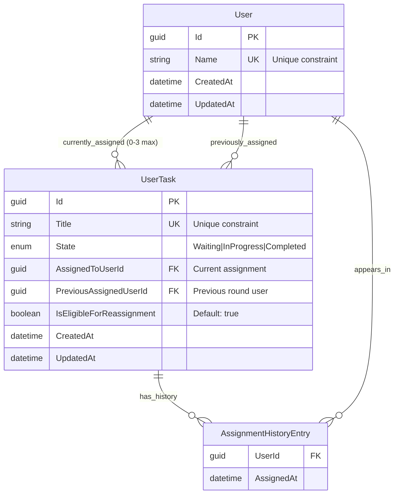

# Technical Specification - Task Management API

## Architecture Overview

This API follows a clean architecture pattern with separation of concerns:

- **Controllers** - Handle HTTP requests and responses
- **Services** - Business logic and data management
- **Models** - Domain entities and data structures
- **DTOs** - Data transfer objects for API contracts
- **Background Services** - Automated task reassignment processing

## Technology Stack

- **.NET 9.0** - Latest LTS framework for performance and modern C# features
- **ASP.NET Core Web API** - RESTful API framework with built-in dependency injection
- **In-memory data storage** - ConcurrentDictionary for thread-safe operations
- **Hosted Services** - Background task processing for automated reassignment
- **Swagger/OpenAPI** - API documentation and testing interface

## API Endpoints

| Method | Endpoint | Description |
|--------|----------|-------------|
| **Users** | | |
| GET | `/api/users` | Get all users |
| GET | `/api/users/{id}` | Get specific user |
| GET | `/api/users/{id}/tasks` | Get user with their tasks |
| POST | `/api/users` | Create new user |
| PUT | `/api/users/{id}` | Update user |
| DELETE | `/api/users/{id}` | Delete user |
| **Tasks** | | |
| GET | `/api/tasks` | Get all tasks |
| GET | `/api/tasks/{id}` | Get specific task |
| POST | `/api/tasks` | Create new task |
| PUT | `/api/tasks/{id}` | Update task |
| DELETE | `/api/tasks/{id}` | Delete task |
| POST | `/api/tasks/{id}/assign/{userId}` | Manually assign task |
| POST | `/api/tasks/{id}/unassign` | Unassign task |

## Data Model

The system uses a simple but effective data model designed for task rotation and assignment tracking:



### Design Decisions

- **GUID Primary Keys**: Ensure global uniqueness and avoid sequence dependencies
- **Unique Constraints**: Business rules enforced at service layer for names and titles  
- **Nullable FKs**: Tasks can exist without current assignment (Waiting state)
- **Embedded Collections**: AssignmentHistory stored as list for simplicity in in-memory storage
- **Audit Fields**: CreatedAt/UpdatedAt for all entities to support debugging and analysis


## Business Logic Implementation

### Task Assignment Logic

#### Automatic Assignment (Task Creation)
1. Find users with capacity (< 3 active tasks)
2. Select first available user
3. Assign task and set state to InProgress
4. Record assignment in history

#### Manual Assignment
1. Validate target user exists
2. Check user capacity constraint
3. Update assignment with history tracking
4. Handle state transitions appropriately

#### User Deletion Reassignment
1. Identify active tasks for deleted user
2. For each task, find available users
3. Reassign if capacity available, otherwise mark Waiting
4. Preserve assignment history

### Automatic Reassignment System

#### Background Service Implementation
- **Service Type**: Hosted Service (IHostedService)
- **Interval**: 2 minutes (configurable via TimeSpan)
- **Threading**: Scoped service injection for thread safety
- **Error Handling**: Comprehensive logging and exception handling


## Data Storage Strategy

### In-Memory Storage Rationale
- **Performance**: Fastest possible access for demonstration purposes
- **Simplicity**: No external dependencies or setup required
- **Thread Safety**: ConcurrentDictionary provides safe concurrent operations
- **Development Focus**: Allows focus on business logic over infrastructure

### Thread Safety Considerations
- **ConcurrentDictionary**: Thread-safe collections for users and tasks
- **Lock Objects**: Additional synchronization for complex operations
- **Atomic Operations**: Ensure consistency during reassignment cycles

### Data Consistency
- **Unique Constraints**: Enforced at service layer for names and titles
- **Referential Integrity**: Manual validation of user-task relationships
- **Audit Trail**: Complete assignment history maintained for all operations

## Error Handling Strategy

### Validation Errors
- **Required Fields**: Comprehensive validation with descriptive messages
- **Unique Constraints**: Clear error messages for duplicate names/titles
- **Capacity Limits**: Specific messaging about task limits

### Business Rule Violations
- **Task Limits**: Prevents assignment when user at capacity
- **Invalid References**: Validates user existence before assignment
- **State Transitions**: Ensures valid state changes

### Service Errors
- **Background Service**: Logging and recovery for reassignment failures
- **Concurrent Operations**: Handling of race conditions in multi-user scenarios
- **Data Consistency**: Rollback mechanisms for failed operations

## Testing Strategy

### Postman Collection Coverage
- **CRUD Operations**: Complete coverage of all endpoints
- **Business Rules**: Validation of task limits and unique constraints  
- **Reassignment Logic**: Scenarios testing automatic assignment rules
- **Error Conditions**: Invalid inputs and edge cases
- **Integration Flow**: End-to-end user and task lifecycle testing

## Deployment Requirements

### Prerequisites
- .NET 9.0 SDK installed
- No external database or services required
- No additional configuration needed

### Running the Application
```bash
cd TaskManagementApi
dotnet run
```

### Development Tools
- Swagger UI available at `/swagger`
- Postman collection for comprehensive testing
- Logging output for reassignment cycle monitoring

